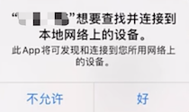

# API Example iOS

_[English](README.md) | 中文_

## 简介

该仓库包含了使用 RTC Objective-C SDK for iOS 的示例项目。


## 项目结构

此项目使用一个单独的 app 实现了多种功能。每个功能以 storyboard 的形式加载，方便你进行试用。

| Function                                                           | Location                                                                                                                 |
| ------------------------------------------------------------------ | ------------------------------------------------------------------------------------------------------------------------ |
| 音视频直播                                                         | [LiveStreaming.swift](./APIExample/Examples/Advanced/LiveStreaming/LiveStreaming.swift)                                  |
| 自定义音频采集                                                     | [CustomAudioSource.swift](./APIExample/Examples/Advanced/CustomAudioSource/CustomAudioSource.swift)                      |
| 自定义视频渲染                                                     | [CustomVideoRender.swift](./APIExample/Examples/Advanced/CustomVideoRender/CustomVideoRender.swift)                      |
| 原始音视频数据 (Objective-C 混编 C++, 使用 `AgoraMediaRawData.h` ) | [RawMediaData.swift](./APIExample/Examples/Advanced/RawMediaData/RawMediaData.swift)                                     |
| 原始音频数据 (Native Objective-C 接口)                             | [RawAudioData.swift](./APIExample/Examples/Advanced/RawAudioData/RawAudioData.swift)                                     |
| 自定义视频采集 (Push)                                              | [CustomVideoSourcePush.swift](./APIExample/Examples/Advanced/CustomVideoSourcePush/CustomVideoSourcePush.swift)          |
| 自定义视频采集 (mediaIO)                                           | [CustomVideoSourceMediaIO.swift](./APIExample/Examples/Advanced/CustomVideoSourceMediaIO/CustomVideoSourceMediaIO.swift) |
| 切换频道                                                           | [QuickSwitchChannel.swift](./APIExample/Examples/Advanced/QuickSwitchChannel/QuickSwitchChannel.swift)                   |
| 加入多频道                                                         | [JoinMultiChannel.swift](.Examples/Advanced/JoinMultiChannel/JoinMultiChannel.swift)                                     |
| 加入频道（音频）                                                   | [JoinChannelAudio.swift](./APIExample/Examples/Basic/JoinChannelAudio/JoinChannelAudio.swift)                            |
| 加入频道（音视频）                                                 | [JoinChannelVideo.swift](./APIExample/Examples/Basic/JoinChannelAudio/JoinChannelVideo.swift)                            |
| 混音与音频文件播放                                                 | [AudioMixing.swift](API-Examples/iOS/APIExample/Examples/Advanced/AudioMixing/AudioMixing.swift)                         |
| 变声与音效                                                         | [VoiceChanger.swift](./APIExample/Examples/Advanced/VoiceChanger/VoiceChanger.swift)                                     |
| 媒体播放器组件                                                     | [MediaPlayer.swift](./APIExample/Examples/Advanced/MediaPlayer/MediaPlayer.swift)                                        |
| RTMP 推流                                                          | [RTMPStreaming.swift](./APIExample/Examples/Advanced/RTMPStreaming/RTMPStreaming.swift)                                  |
| 媒体流加密（自定义加密 + SDK 加密）                                | [StreamEncryption.swift](./APIExample/Examples/Advanced/StreamEncryption/StreamEncryption.swift)                         |
| 视频元数据                                                         | [VideoMetadata.swift](./APIExample/Examples/Advanced/VideoMetadata/VideoMetadata.swift)                                  |
| 多人视频聊天                                                       | [VideoChat.swift](./APIExample/Examples/Advanced/VideoChat/VideoChat.swift)                                              |
| 呼叫前测试                                                         | [PrecallTest.swift](./APIExample/Examples/Advanced/PrecallTest/PrecallTest.swift)                                        |
| 频道媒体流转发                                                     | [MediaChannelRelay.swift](./APIExample/Examples/Advanced/MediaChannelRelay/MediaChannelRelay.swift)                      |
| 超级分辨率                                                         | [SuperResolution.swift](./APIExample/Examples/Advanced/SuperResolution/SuperResolution.swift)                            |
| 多进程同时发送屏幕共享流和摄像头采集流                             | [ScreenShare.swift](./APIExample/Examples/Advanced/ScreenShare/ScreenShare.swift)                                        |
| 使用自定义视频采集 (mediaIO) 实现 AR 功能                          | [ARKit.swift](./APIExample/Examples/Advanced/ARKit/ARKit.swift)                                                          |
| 发送数据流                                                         | [CreateDataStream.swift](./APIExample/Examples/Advanced/CreateDataStream/CreateDataStream.swift)                         |
| 区域访问限制                                                       | [GlobalSettings.swift](./APIExample/Common/GlobalSettings.swift)                                                         |

## 如何运行示例项目

### 前提条件

- XCode 10.0 +
- iOS 真机设备
- 不支持模拟器

## 运行步骤

1. 切换到 **iOS** 目录，运行以下命令使用 CocoaPods 安装依赖，Agora 视频 SDK 会在安装后自动完成集成。

```shell
pod install
```

2. 使用 Xcode 打开生成的 `APIExample.xcworkspace`。
3. 编辑 `KeyCenter.swift` 文件。

   - 将 `YOUR APP ID` 替换为你的 App ID。
   - 将 `YOUR ACCESS TOKEN` 替换为你的 Access Token。

   ```swift
   struct KeyCenter {
   static let AppId: String = <#Your App Id#>

   // assign token to nil if you have not enabled app certificate
   static var Token: String? = <#Temp Access Token#>
   }
   ```

   > 参考 [开始使用 Agora 平台](https://docs.agora.io/cn/Agora%20Platform/get_appid_token) 了解如何获取 App ID 和 Token。你可以获取一个临时 token，快速运行示例项目。
   >
   > 生成 Token 使用的频道名必须和加入频道时使用的频道名一致。

   > 为提高项目的安全性，Agora 使用 Token（动态密钥）对即将加入频道的用户进行鉴权。
   >
   > 临时 Token 仅作为演示和测试用途。在生产环境中，你需要自行部署服务器签发 Token，详见[生成 Token](https://docs.agora.io/cn/Interactive%20Broadcast/token_server)。

4. 构建并在 iOS 设备中运行项目。

一切就绪。你可以自由探索示例项目，体验 RTC Objective-C for iOS SDK 的丰富功能。

## 反馈

如果你有任何问题或建议，可以通过 issue 的形式反馈。

## 参考文档

- [RTC Objective-C SDK 产品概述](https://docs.agora.io/cn/Interactive%20Broadcast/product_live?platform=iOS)
- [RTC Objective-C SDK API 参考](https://docs.agora.io/cn/Interactive%20Broadcast/API%20Reference/oc/docs/headers/Agora-Objective-C-API-Overview.html)

## 相关资源

- 你可以先参阅 [常见问题](https://docs.agora.io/cn/faq)
- 如果你想了解更多官方示例，可以参考 [官方 SDK 示例](https://github.com/AgoraIO)
- 如果你想了解声网 SDK 在复杂场景下的应用，可以参考 [官方场景案例](https://github.com/AgoraIO-usecase)
- 如果你想了解声网的一些社区开发者维护的项目，可以查看 [社区](https://github.com/AgoraIO-Community)
- 若遇到问题需要开发者帮助，你可以到 [开发者社区](https://rtcdeveloper.com/) 提问
- 如果需要售后技术支持, 你可以在 [Agora Dashboard](https://dashboard.agora.io) 提交工单

## 已知问题

iOS 系统版本升级至 14.0 版本后，用户首次使用集成了 **v3.1.2 或之前版本**声网 iOS 语音或视频 SDK 的 app 时会看到查找本地网络设备的弹窗提示。默认弹窗界面如下图所示：



[解决方案](https://docs.agora.io/cn/faq/local_network_privacy)

## 代码许可

示例项目遵守 MIT 许可证。
